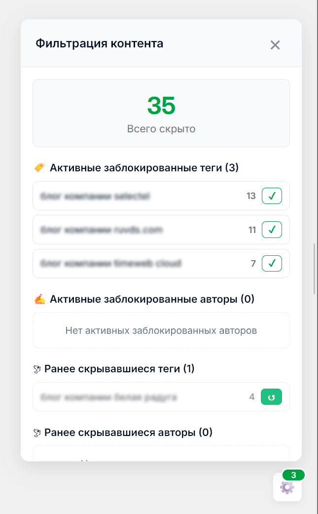
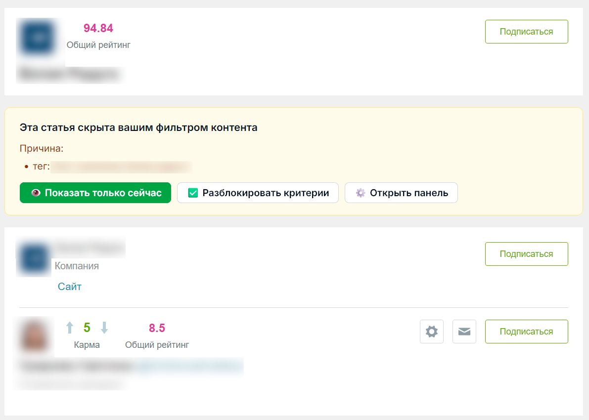

# Habr Content Filter  
Минималистичный userscript для персональной фильтрации контента на Хабре.  
Позволяет скрывать ненужные статьи, блокировать авторов и корпоративные блоги, фильтровать публикации по тегам и управлять правилами через удобную панель.

---

## 🚀 Возможности

- Скрытие статей по авторам  
- Скрытие публикаций корпоративных блогов  
- Фильтрация контента по тегам  
- Контекстное меню на каждой статье  
- Панель управления для включения/выключения правил  
- Возможность повторной блокировки ранее скрытых элементов  
- Полное скрытие статей в дайджестах Хабра  
- Работает локально, данные сохраняются только в браузере  

---

## 🧩 Установка

### 1. Установите расширение

- Chrome / Edge → **Tampermonkey**  
  https://chrome.google.com/webstore/detail/tampermonkey/dhdgffkkebhmkfjojejmpbldmpobfkfo  
- Firefox → **Tampermonkey**  
  https://addons.mozilla.org/ru/firefox/addon/tampermonkey/  

### 2. Установите скрипт

👉 https://aifixed.github.io/userscripts/scripts/habr-content-filter.user.js

Скрипт будет обновляться автоматически.

---

## 📸 Скриншоты

### Контекстное меню  

### Панель управления  

### Пример скрытой статьи  

---

## ⚙️ Поддерживаемые разделы Habr

- Главная лента `/feed/`  
- Статьи `/articles/`  
- Компании `/companies/`  
- Хабы `/hubs/`  
- Профили пользователей `/users/`  
- Дайджесты и подборки  
- Страницы корпоративных блогов  

---

## 🔄 Автоматические обновления

Скрипт обновляется через GitHub Pages:
@updateURL https://aifixed.github.io/userscripts/scripts/habr-content-filter.user.js
@downloadURL https://aifixed.github.io/userscripts/scripts/habr-content-filter.user.js

---

## 🛠 Поддержка

Сообщить об ошибке или предложить улучшение:  
👉 https://github.com/aifixed/userscripts/issues

---

## 📄 Лицензия

MIT License — свободно используйте и модифицируйте.
